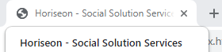
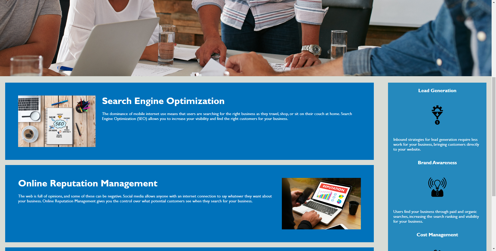
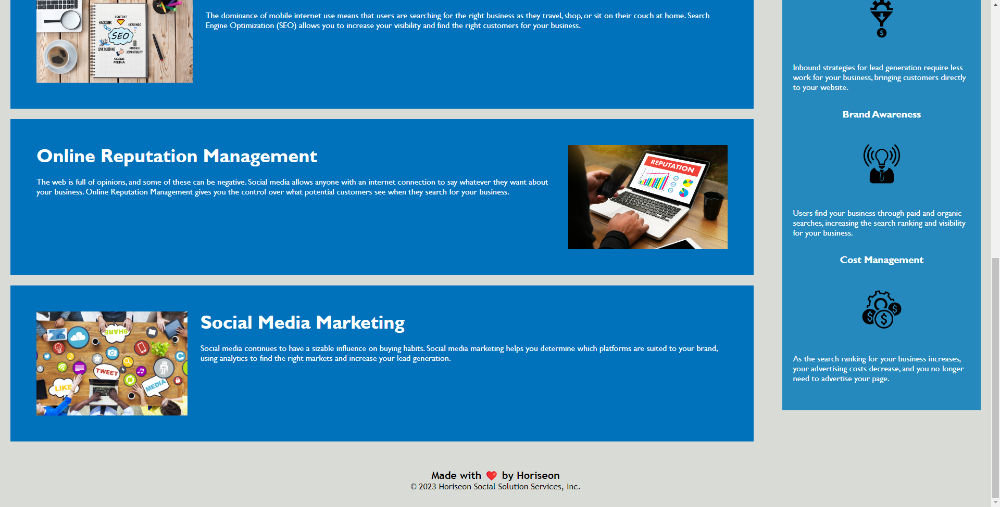

# Webpage Optimization for the Marketing Site: Horiseon - Social Solution Services

## Description

The purpose of this repository is to perform a website refactor on Horiseon, ensuring it conforms to accessibility standards and is optimized for search engines.

## Visuals

## Deployed Webpage

## Installation

N/A

## Credits

N/A

## License

N/A